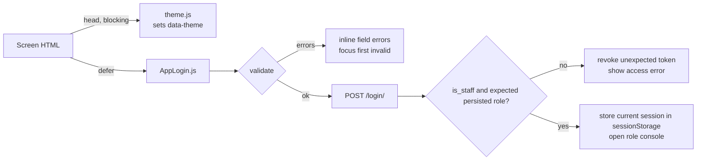

# MetroDripJS Setup & Emulator Guide

> **Architecture transition:** The approved production target is one secured modular Django monolith, one Render Free web service, and one Render Free PostgreSQL database. COD plus PayMongo Hosted Checkout for GCash, Maya, and cards is in scope. No paid Render resource, worker, cron, Redis/Key Value, disk, autoscaling, or upgrade is authorized. The microservice/Compose commands later in this guide reproduce the historical baseline for regression only; they are not the target deployment runbook. Follow [Architecture and Operations](Architecture%20and%20Operations.md) and the active [ADRs](Decisions%20and%20Handover.md#active-architecture-decisions--2026-09-28).

## Current modular-monolith backend

The supported implementation path for this enhancement is `metrodrip_backend/`, not the five-service comparison stack later in this guide.

### Install, migrate, and run

```powershell
cd metrodrip_backend
python -m venv .venv
.\.venv\Scripts\Activate.ps1
python -m pip install -r requirements.txt
python manage.py migrate
python manage.py runserver 127.0.0.1:8000
```

On Linux/macOS, activate with `source .venv/bin/activate`. The default database is `metrodrip_backend/db.sqlite3` unless `DATABASE_URL` is set. `GET http://127.0.0.1:8000/health/` is a liveness check only; it does not query the database or PayMongo.

Do not use legacy seed users as staff authorization. Provision staff interactively:

```powershell
python manage.py provision_staff --email admin@example.com --name "MetroDrip Admin" --role admin
python manage.py provision_staff --email merchant@example.com --name "MetroDrip Merchant" --role merchant
```

The command prompts twice for a validated password, hashes it, and persists `is_staff=true` with the selected `admin` or `merchant` role. It does not accept a password on the command line.

### Optional online-payment environment

COD works without PayMongo configuration. Hosted GCash/Maya/card and the webhook require server-side values:

```env
PAYMONGO_MODE=test
PAYMONGO_SECRET_KEY=replace-in-local-environment
PAYMONGO_WEBHOOK_SECRET=replace-in-local-environment
PAYMONGO_SUCCESS_URL=https://your-authorized-host/payment/return?result=success
PAYMONGO_CANCEL_URL=https://your-authorized-host/payment/return?result=cancelled
```

Never put those secrets in Expo public variables, JavaScript, Figma, Git, screenshots, or logs. Missing provider configuration fails the affected online operation closed; it does not justify a fake success or paid Render resource.

### Current verification workflow

Release is **HOLD**. See the [current QA report](QA%20Report%202026-09-28.md) for executed evidence and open blockers; setup instructions are not release certification.

Run the active backend checks from `metrodrip_backend/`:

```powershell
python manage.py test
python manage.py check --deploy
python manage.py makemigrations --check
python manage.py migrate --plan
```

Then run client/static checks from the repository root:

```powershell
npm ci
npm run test:client
npx tsc --noEmit
```

Final counts are recorded only after the current rerun in [Verification and Evaluation](Verification%20and%20Evaluation.md). SQLite/unit/source checks are not native-device, live-provider, PostgreSQL, or Render evidence.

For historical non-destructive API regression, run `python -B scripts/verify_microservices_e2e.py` from the repository root using an interpreter with the service dependencies installed. It uses disposable SQLite databases, synthetic fixtures, random loopback ports, and owned-process cleanup. It does not verify the active monolith, PostgreSQL, PayMongo, or Render. Do not run legacy seed commands as test setup: they can import existing application data.

For mocked staff-console checks, install Chromium with `npx playwright install chromium`, start `npm run dev` in one terminal, and run `npm run test:browser` in another. The runner expects `127.0.0.1:3000`; it does not launch that server. It checks responsive layouts plus representative loading/default/empty/partial/error/retry/permission/fixture states, failed-write truthfulness, Escape dismissal, focus return, and Tab containment. API responses are mocked and external resources are blocked, so it does not verify browser-to-Django integration or native screens.

| Setting | QA / Development Behavior |
| --- | --- |
| `DATABASE_URL` | Active monolith defaults to local SQLite; set a PostgreSQL URL only for an authorized target test. Historical runner overrides each old service with a temporary SQLite file. |
| `IDENTITY_SERVICE_URL` | Catalog, Orders, Fulfillment and Content validate bearer tokens through Identity; Compose uses `http://identity-service:8001` |
| `BIND_HOST` | Python gateway and development static server default to `127.0.0.1`; broader binding is an explicit operational choice |
| Checkout idempotency | Active `POST /api/orders/checkout/` requires `idempotency_key` in JSON. `X-Idempotency-Key` describes only the historical gateway path. |
| Gateway `/health/` | Returns 503 when an upstream dependency is unhealthy |

The previous dated QA run used Python 3.15.0b2/Django 5.2.16. Repeat final checks on the supported runtime. Docker/PostgreSQL, PayMongo delivery, connected Render, and native devices were not established by that historical run.

MetroDripJS is an Expo shopping application built with React Native.

## Prerequisites and versions

Install a Python version compatible with the pinned Django/psycopg requirements, Node.js, and npm, then open a terminal in the repository. Linux was previously verified with Node 22.23.2 and npm 10.9.8; the final enhancement rerun is tracked separately.

| Component | Version |
| --- | --- |
| Expo | 54.0.37 (SDK 54) |
| React / React DOM | 19.1.0 |
| React Native | 0.81.5 |
| Android Package | `com.metrodrip.js` |
| Deep Link Scheme | `metrodripjs` |

---

## Running on Android Emulator

### 1. Environment & SDK Setup

Ensure Android Studio and the Android SDK are installed with the following environment variables configured:

```sh
# Linux / macOS (e.g. in ~/.bashrc or ~/.zshrc)
export ANDROID_HOME=$HOME/Android/Sdk
export PATH=$PATH:$ANDROID_HOME/emulator
export PATH=$PATH:$ANDROID_HOME/platform-tools
export PATH=$PATH:$ANDROID_HOME/cmdline-tools/latest/bin
```

Verify `adb` is available by running:
```sh
adb devices
```

### 2. Launching an Android Virtual Device (AVD)

1. Open **Android Studio** → **Virtual Device Manager** (or **Device Manager**).
2. Create or select a virtual device (e.g., Pixel 8 running API Level 34 or higher).
3. Start the emulator.
4. Confirm `adb devices` lists `emulator-5554` (or similar).

Alternatively, launch an existing AVD from the CLI:
```sh
emulator -list-avds
emulator -avd <avd_name>
```

### 3. Project Configuration for Android

The project settings in `app.json` are pre-configured for Android emulator compatibility:

```json
{
  "expo": {
    "scheme": "metrodripjs",
    "android": {
      "package": "com.metrodrip.js",
      "adaptiveIcon": {
        "foregroundImage": "./assets/adaptive-icon.png",
        "backgroundColor": "#ffffff"
      },
      "edgeToEdgeEnabled": true,
      "usesCleartextTraffic": true
    }
  }
}
```

- **`usesCleartextTraffic: true`**: Allows local HTTP backend connections during development.
- **`package: "com.metrodrip.js"`**: Configures the Android application package identifier required for native builds and Expo CLI device targeting.

### 4. Running the App on Emulator

Start the emulator first, then execute either of the following scripts from the project root:

#### Option A: Fast Development via Expo Go (Recommended)
```sh
npm run android
# or: npx expo start --android
```
Expo CLI automatically detects the running emulator, installs Expo Go if needed, and streams the bundle directly.

#### Option B: Native Prebuild & Build (`expo run:android`)
```sh
npm run android:run
# or: npx expo run:android
```
Generates the native `android/` directory and compiles the APK using Gradle directly onto the emulator.

### 5. Backend Connection on Android Emulator

When the active backend runs on the host at `http://127.0.0.1:8000`, the Android emulator accesses the host machine through `10.0.2.2`.

Update `.env` accordingly when testing local backend integration:
```env
# For host-machine local backend:
EXPO_PUBLIC_API_URL=http://10.0.2.2:8000

# For remote production backend:
# EXPO_PUBLIC_API_URL=https://metrodripjs.onrender.com
```

---

## Other Commands

| Command | Description |
| --- | --- |
| `npm run dev` | Start local web dev server on port 3000 (`python web/dev_server.py 3000`) |
| `npm start` | Start Metro bundler |
| `npm run android` | Launch app on connected Android emulator or device |
| `npm run android:run` | Build native Android app and deploy to emulator |
| `npm run web` | Run app in browser mode |
| `npm run ios` | Run on iOS Simulator (macOS required) |


---

## Troubleshooting

1. **`adb: command not found`**: Ensure `$ANDROID_HOME/platform-tools` is added to your shell `PATH`.
2. **No emulator detected**: Launch the AVD from Android Studio Device Manager before running `npm run android`.
3. **Port 8081 occupied**: Run `npx expo start --android --port 8082`.
4. **Network requests fail on emulator**: If connecting to a local backend, use `10.0.2.2` instead of `localhost` in `.env`.

---

## Web Staff Login Pages (`web/`)

The `web/` folder holds the browser-only Merchant and Administrator login screens and consoles. They are plain HTML, CSS, and JavaScript served by the local Python server; Playwright is a development dependency only for the browser harness. They are separate from the Expo app.

### Folder layout (mirrors `mobile/`)

| `mobile/` path | `web/` path | Role |
| --- | --- | --- |
| `mobile/Registration/AppLogin.js` | `web/Registration/AppLogin.js` | Login entry and controller (validation, submit) |
| `mobile/Registration/theme.js` | `web/Registration/theme.js` + `theme.css` | Light/dark mode resolution + colour tokens |
| `mobile/Registration/screens/LoginScreen.js` | `web/Registration/screens/LoginScreen.css` | Shared login screen layout |
| — | `web/Registration/screens/MerchantLoginScreen.html` | Merchant login page (Figma 464:2 / 464:206) |
| — | `web/Registration/screens/AdminLoginScreen.html` | Administrator login page (Figma 461:2 / 464:104) |
| `mobile/assets/` | `web/assets/` | `deco-ring.svg` (exported from Figma), `favicon.png` |



### Run it

Use the repository server on the CORS-allowlisted development origin:

```powershell
npm run dev
```

Open:

- Merchant: `http://127.0.0.1:3000/Registration/screens/MerchantLoginScreen.html`
- Administrator: `http://127.0.0.1:3000/Registration/screens/AdminLoginScreen.html`

**Working means:** the two-panel card renders, empty submit shows inline errors, and valid credentials reach `POST http://127.0.0.1:8000/login/`. A merchant login accepts only persisted `merchant` staff; an administrator login accepts only persisted `admin` staff. The successful account/token is stored in `sessionStorage`, console requests send `Authorization: Bearer …`, and sign out calls the role API before clearing local state.

### Limits to know

- Sign-in is real and server-verified, but authorization is coarse persisted-role RBAC only. Store-scoped ABAC/permissions, MFA, and recent-authentication checks are not implemented. `VERIFIED SESSION` means the bearer session was authenticated; it is not a 2FA claim.
- Fonts (Anton, IBM Plex Mono, Inter) load from Google Fonts. Offline, the pages fall back to Impact / Courier New / Arial.
- "← Return to storefront" links to `/`, which is the storefront only when the pages are deployed alongside it.

### Troubleshooting

1. **Unstyled page or missing ring graphic**: the server root is not `web/`. Paths such as `../../assets/deco-ring.svg` need `web/` as root.
2. **Immediate redirect to login**: provision the correct staff role, sign in through the matching page, and confirm the browser permits `sessionStorage`.
3. **`401`/`403` console API response**: the token is missing, expired/revoked, the account is inactive, or the persisted role does not authorize that API. Sign out and authenticate explicitly; client-side account switching is retired.
4. **Theme does not persist**: the browser is blocking site storage (private window). The theme still switches for the current page.
5. **Port 3000 in use**: stop the owning process or choose another static port and add that exact authorized origin to `DJANGO_CORS_ALLOWED_ORIGINS` for local development.

---

## Render free-only Blueprint

[`render.yaml`](../render.yaml) is prepared for human review but has not been applied. It declares:

- preview generation off;
- `autoDeployTrigger: off`;
- one Python web service with `plan: free`;
- one PostgreSQL database with `plan: free` and no public IP allowlist;
- no worker, cron, Key Value/Redis, disk, autoscaling, HA, replica, or other paid resource.

Do not apply the Blueprint if the dashboard asks for a paid resource. Render's current free PostgreSQL lifecycle (1 GB, expiry after 30 days, 14-day grace period, and no managed backups/pooling) does not satisfy durable production commerce requirements. Production release is therefore **HOLD** even though the file itself is free-only. Live Blueprint creation, database migration, cold-start behavior, and restore remain **UNVERIFIED**.

---

## Historical Microservices Regression Environment

This local comparison environment runs **five independently deployable Django services** and an API Gateway with dedicated private databases. It is retained to regression-test migrated behavior and does not define the approved Render topology.

### Service Matrix & Ports

| Service | Port | Database | Primary Responsibility | Directory |
| --- | --- | --- | --- | --- |
| **API Gateway** | `8000` | N/A (Edge) | Reverse proxy, path routing, `X-Correlation-ID` injection | `gateway/` |
| **Identity** | `8001` | `db_identity` | Accounts, PBKDF2 password hashing, AuthTokens, RBAC | `services/identity/` |
| **Catalog** | `8002` | `db_catalog` | Categories, products, variants, quotes, stock reservations | `services/catalog/` |
| **Orders** | `8003` | `db_orders` | COD saga orchestration, immutable snapshots, outbox, reviews | `services/orders/` |
| **Fulfillment** | `8004` | `db_fulfillment` | Shipping quotes, zones, shipments, notifications | `services/fulfillment/` |
| **Content** | `8005` | `db_content` | Homepage banners, contact inquiries, CMS | `services/content/` |

### Running Locally (All Services + Gateway)

You can launch and verify all 5 microservices plus the API Gateway simultaneously with the automated orchestrator:

```powershell
# Run the automated end-to-end integration verifier
metrodrip_backend\.venv\Scripts\python.exe scripts\verify_microservices_e2e.py
```

To run individual services manually:

```powershell
# Terminal 1: Identity Service
cd services\identity
..\..\metrodrip_backend\.venv\Scripts\python.exe manage.py runserver 127.0.0.1:8001 --noreload

# Terminal 2: Catalog Service
cd services\catalog
..\..\metrodrip_backend\.venv\Scripts\python.exe manage.py runserver 127.0.0.1:8002 --noreload

# Terminal 3: Orders Service
cd services\orders
..\..\metrodrip_backend\.venv\Scripts\python.exe manage.py runserver 127.0.0.1:8003 --noreload

# Terminal 4: Fulfillment Service
cd services\fulfillment
..\..\metrodrip_backend\.venv\Scripts\python.exe manage.py runserver 127.0.0.1:8004 --noreload

# Terminal 5: Content Service
cd services\content
..\..\metrodrip_backend\.venv\Scripts\python.exe manage.py runserver 127.0.0.1:8005 --noreload

# Terminal 6: API Gateway
python gateway\gateway.py
```

### Historical containerized comparison via Docker Compose

A complete production multi-container environment with PostgreSQL 16 (isolated role-per-database), all 5 microservices, and Nginx edge gateway is defined in `docker-compose.microservices.yml`:

```sh
# Start all microservices, isolated PostgreSQL databases, and edge gateway
docker compose -f docker-compose.microservices.yml up --build -d

# Verify all services report healthy
curl -i http://localhost:8000/health/
```

