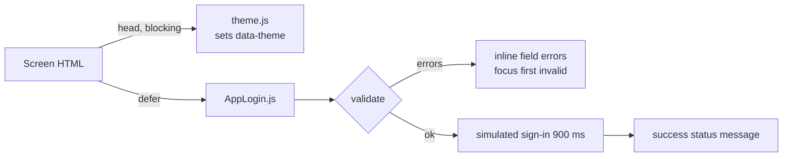

# MetroDripJS Setup & Emulator Guide

MetroDripJS is an Expo shopping application built with React Native.

## Prerequisites and versions

Install Node.js and npm, then open a terminal in the repository. Linux was verified with Node 22.23.2 and npm 10.9.8.

| Component | Version |
| --- | --- |
| Expo | 54.0.37 (SDK 54) |
| React / React DOM | 19.1.0 |
| React Native | 0.81.5 |
| Android Package | `com.metrodrip.js` |
| Deep Link Scheme | `metrodripjs` |

---

## Running on Android Emulator

### 1. Environment & SDK Setup

Ensure Android Studio and the Android SDK are installed with the following environment variables configured:

```sh
# Linux / macOS (e.g. in ~/.bashrc or ~/.zshrc)
export ANDROID_HOME=$HOME/Android/Sdk
export PATH=$PATH:$ANDROID_HOME/emulator
export PATH=$PATH:$ANDROID_HOME/platform-tools
export PATH=$PATH:$ANDROID_HOME/cmdline-tools/latest/bin
```

Verify `adb` is available by running:
```sh
adb devices
```

### 2. Launching an Android Virtual Device (AVD)

1. Open **Android Studio** → **Virtual Device Manager** (or **Device Manager**).
2. Create or select a virtual device (e.g., Pixel 8 running API Level 34 or higher).
3. Start the emulator.
4. Confirm `adb devices` lists `emulator-5554` (or similar).

Alternatively, launch an existing AVD from the CLI:
```sh
emulator -list-avds
emulator -avd <avd_name>
```

### 3. Project Configuration for Android

The project settings in `app.json` are pre-configured for Android emulator compatibility:

```json
{
  "expo": {
    "scheme": "metrodripjs",
    "android": {
      "package": "com.metrodrip.js",
      "adaptiveIcon": {
        "foregroundImage": "./assets/adaptive-icon.png",
        "backgroundColor": "#ffffff"
      },
      "edgeToEdgeEnabled": true,
      "usesCleartextTraffic": true
    }
  }
}
```

- **`usesCleartextTraffic: true`**: Allows local HTTP backend connections during development.
- **`package: "com.metrodrip.js"`**: Configures the Android application package identifier required for native builds and Expo CLI device targeting.

### 4. Running the App on Emulator

Start the emulator first, then execute either of the following scripts from the project root:

#### Option A: Fast Development via Expo Go (Recommended)
```sh
npm run android
# or: npx expo start --android
```
Expo CLI automatically detects the running emulator, installs Expo Go if needed, and streams the bundle directly.

#### Option B: Native Prebuild & Build (`expo run:android`)
```sh
npm run android:run
# or: npx expo run:android
```
Generates the native `android/` directory and compiles the APK using Gradle directly onto the emulator.

### 5. Backend Connection on Android Emulator

When running a local backend server on your host machine (e.g. `http://localhost:5000`), the Android emulator accesses the host machine's `localhost` via the special IP address `10.0.2.2`.

Update `.env` accordingly when testing local backend integration:
```env
# For host-machine local backend:
EXPO_PUBLIC_API_URL=http://10.0.2.2:5000

# For remote production backend:
# EXPO_PUBLIC_API_URL=https://metrodripjs.onrender.com
```

---

## Other Commands

| Command | Description |
| --- | --- |
| `npm run dev` | Start local web dev server on port 3000 (`python web/dev_server.py 3000`) |
| `npm start` | Start Metro bundler |
| `npm run android` | Launch app on connected Android emulator or device |
| `npm run android:run` | Build native Android app and deploy to emulator |
| `npm run web` | Run app in browser mode |
| `npm run ios` | Run on iOS Simulator (macOS required) |


---

## Troubleshooting

1. **`adb: command not found`**: Ensure `$ANDROID_HOME/platform-tools` is added to your shell `PATH`.
2. **No emulator detected**: Launch the AVD from Android Studio Device Manager before running `npm run android`.
3. **Port 8081 occupied**: Run `npx expo start --android --port 8082`.
4. **Network requests fail on emulator**: If connecting to a local backend, use `10.0.2.2` instead of `localhost` in `.env`.

---

## Web Staff Login Pages (`web/`)

The `web/` folder holds the browser-only Merchant and Administrator login screens. They are plain HTML, CSS, and JavaScript with no build step and no npm dependencies, and they are separate from the Expo app.

### Folder layout (mirrors `mobile/`)

| `mobile/` path | `web/` path | Role |
| --- | --- | --- |
| `mobile/Registration/AppLogin.js` | `web/Registration/AppLogin.js` | Login entry and controller (validation, submit) |
| `mobile/Registration/theme.js` | `web/Registration/theme.js` + `theme.css` | Light/dark mode resolution + colour tokens |
| `mobile/Registration/screens/LoginScreen.js` | `web/Registration/screens/LoginScreen.css` | Shared login screen layout |
| — | `web/Registration/screens/MerchantLoginScreen.html` | Merchant login page (Figma 464:2 / 464:206) |
| — | `web/Registration/screens/AdminLoginScreen.html` | Administrator login page (Figma 461:2 / 464:104) |
| `mobile/assets/` | `web/assets/` | `deco-ring.svg` (exported from Figma), `favicon.png` |



### Run it

Any static file server works. Serve the `web/` folder as the site root so the relative paths resolve.

```sh
# Linux / macOS
python3 -m http.server 8765 --bind 127.0.0.1 -d web

# Windows (PowerShell)
py -m http.server 8765 --bind 127.0.0.1 -d web

# Any OS with Node.js
npx serve web -l 8765
```

Open:

- Merchant: `http://127.0.0.1:8765/Registration/screens/MerchantLoginScreen.html`
- Administrator: `http://127.0.0.1:8765/Registration/screens/AdminLoginScreen.html`

**Working means:** the two-panel card renders (dark brand panel on the left, form on the right). Pressing **LOG IN** with empty fields shows red inline errors. Valid input shows "SIGNING IN…" and then a "✓ Signed in as …" message. **☾ Dark** switches the form panel to dark and is remembered on both screens.

### Limits to know

- Sign-in is **simulated**. `metrodrip_backend` has no staff-login endpoint yet, so `simulateSignIn()` in `AppLogin.js` must be replaced with a real request. Role checks and 2FA must be enforced server-side.
- Fonts (Anton, IBM Plex Mono, Inter) load from Google Fonts. Offline, the pages fall back to Impact / Courier New / Arial.
- "← Return to storefront" links to `/`, which is the storefront only when the pages are deployed alongside it.

### Troubleshooting

1. **Unstyled page or missing ring graphic**: the server root is not `web/`. Paths such as `../../assets/deco-ring.svg` need `web/` as root.
2. **Theme does not persist**: the browser is blocking site storage (private window). The theme still switches for the current page.
3. **Port 8765 in use**: pick another port, e.g. `python3 -m http.server 8080 -d web`.

---

## Microservices Architecture & Execution

MetroDripJS backend is decomposed into **five independently deployable Django services** and an API Gateway with dedicated private databases, zero cross-service ORM imports, and snapshot-based boundary contracts.

### Service Matrix & Ports

| Service | Port | Database | Primary Responsibility | Directory |
| --- | --- | --- | --- | --- |
| **API Gateway** | `8000` | N/A (Edge) | Reverse proxy, path routing, `X-Correlation-ID` injection | `gateway/` |
| **Identity** | `8001` | `db_identity` | Accounts, PBKDF2 password hashing, AuthTokens, RBAC | `services/identity/` |
| **Catalog** | `8002` | `db_catalog` | Categories, products, variants, quotes, stock reservations | `services/catalog/` |
| **Orders** | `8003` | `db_orders` | COD saga orchestration, immutable snapshots, outbox, reviews | `services/orders/` |
| **Fulfillment** | `8004` | `db_fulfillment` | Shipping quotes, zones, shipments, notifications | `services/fulfillment/` |
| **Content** | `8005` | `db_content` | Homepage banners, contact inquiries, CMS | `services/content/` |

### Running Locally (All Services + Gateway)

You can launch and verify all 5 microservices plus the API Gateway simultaneously with the automated orchestrator:

```powershell
# Run the automated end-to-end integration verifier
metrodrip_backend\.venv\Scripts\python.exe scripts\verify_microservices_e2e.py
```

To run individual services manually:

```powershell
# Terminal 1: Identity Service
cd services\identity
..\..\metrodrip_backend\.venv\Scripts\python.exe manage.py runserver 127.0.0.1:8001 --noreload

# Terminal 2: Catalog Service
cd services\catalog
..\..\metrodrip_backend\.venv\Scripts\python.exe manage.py runserver 127.0.0.1:8002 --noreload

# Terminal 3: Orders Service
cd services\orders
..\..\metrodrip_backend\.venv\Scripts\python.exe manage.py runserver 127.0.0.1:8003 --noreload

# Terminal 4: Fulfillment Service
cd services\fulfillment
..\..\metrodrip_backend\.venv\Scripts\python.exe manage.py runserver 127.0.0.1:8004 --noreload

# Terminal 5: Content Service
cd services\content
..\..\metrodrip_backend\.venv\Scripts\python.exe manage.py runserver 127.0.0.1:8005 --noreload

# Terminal 6: API Gateway
python gateway\gateway.py
```

### Production Deployment via Docker Compose

A complete production multi-container environment with PostgreSQL 16 (isolated role-per-database), all 5 microservices, and Nginx edge gateway is defined in `docker-compose.microservices.yml`:

```sh
# Start all microservices, isolated PostgreSQL databases, and edge gateway
docker compose -f docker-compose.microservices.yml up --build -d

# Verify all services report healthy
curl -i http://localhost:8000/health/
```

